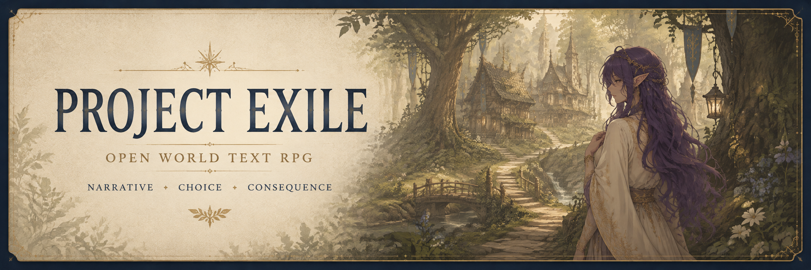

<p align="center">
  
</p>

<p align="center">
  <strong>A narrative role-playing game about survival, consequence, and becoming someone through the choices you make.</strong>
</p>

<p align="center">
  
  
  
  
</p>

---

##About Project Exile

Project Exile is a browser-based, character-focused open-world text RPG currently being developed around its testing region, the Snowlands. It combines authored narrative, exploration and choice-driven passages with RPG systems such as character stats, skill checks, resources, inventory, relationships, and persistent saves.

The goal is to combine a rich, carefully written narrative experience with highly variable playthroughs. Rather than defining a complete character at the beginning, Project Exile takes a slow-burn approach to progression. Early decisions establish elements such as training, possessions, and background, while personality, strengths, weaknesses, relationships, and more unusual traits emerge gradually through play.

The world is intended to feel larger than any single character's journey. Skills, previous choices, discoveries, possessions, relationships, and circumstances can change which opportunities appear and how situations can be approached. Two characters may pass through the same region while experiencing substantially different stories within it.

Project Exile is also being designed with expansion in mind. New locations, characters, quests, encounters, professions, systems, and storylines should be able to grow around the existing world without requiring the game to be rebuilt around them.

Current state: Playable vertical slice / active development. The Snowlands currently serves as the primary development and testing region, with the narrative framework, exploration hub, menu, save system, and foundational character mechanics in place. Broader progression, world content, and combat systems are still being developed.

## What is in the current build

| System | Current state |
| --- | --- |
| Narrative passages & branching choices | ✅ Playable |
| Stat checks with visible chances | ✅ Playable |
| Snowlands hub & weighted event discovery | ✅ Playable |
| Player stats, resources & status effects | ✅ Playable |
| Inventory interface | ✅ Playable |
| Intro sequence | ✅ Foundation in place |
| Main menu, Continue & Load Game | ✅ Playable |
| Three named save slots | ✅ Persistent locally |
| Rename / delete / overwrite save flows | ✅ Playable |
| Persistent accessibility & display settings | ✅ Playable |
| Deeper character development | 🚧 Expanding |
| Full combat system | 🧭 Planned / prototyping |
| Wider world & additional hubs | 🧭 Planned |

## Design direction

Project Exile is being built around a few core ideas:

- **Character creation is a journey, not a form.** The player should keep discovering and defining who their character is well after the opening scene.
- **Failure has different meanings.** A failed lockpick can be experience. A lost fight can leave lasting consequences. Risk should come from context rather than every failure being treated the same way.
- **Chances are visible; outcomes are not.** The player can understand the mechanical risk of a choice without being told every consequence in advance.
- **Systems arrive gradually.** New mechanics should reignite curiosity rather than bury a new player beneath a large UI on their first screen.
- **Specialisation creates different solutions.** Combat, magic, alchemy, equipment and skills should offer genuinely different ways through the same problem instead of acting as cosmetic stat variants.

## The Snowlands

The current vertical slice takes place in a cold, isolated region built around **Pinehollow** and the surrounding wilderness. Events are authored as data-driven node graphs and surfaced through weighted pools, allowing the hub to draw discoveries while still keeping the narrative content deterministic and testable.

The visual direction uses soft parchment tones, restrained colour, hand-drawn linework and low-contrast environmental art so the interface can sit over the world without overpowering it.

## Running the project locally

### Requirements

- **Node.js 22.12+**
- **npm 10+**

### Install and start

```bash
npm install
npm run dev
```

Vite will print the local development URL once the server is ready.

### Verification

```bash
npm run lint              # Type-aware ESLint checks
npm run typecheck         # Strict TypeScript checks
npm test                  # Game-rule and content-contract tests
npm run validate:content  # Validate hubs, events, links and referenced images
npm run build             # Type-check and build the production bundle
npm run check             # Run the complete verification suite
```

## Project structure

```text
src/
  components/             UI grouped by game area
  data/                   Default player, avatar and item data
  engine/                 Pure game rules and state transforms
  pages/                  Page-level state and interaction orchestration
  services/
    content/               Fetching, caching and runtime content validation
    gamePersistence.ts     Save slots, resume state and persistent settings
  types/                  Canonical domain models

tests/                    Rule and content-graph tests
public/
  data/
    hubs/                  Hub definitions
    events/                Narrative event node graphs
  images/                  Runtime artwork and README media
```

`HubPage` owns the active Snowlands session while deterministic game rules live in `src/engine`. Content is loaded through the repository boundary and validated before it reaches the UI. Save data and user settings are kept separate from authored content through `gamePersistence.ts`.

## Content authoring

Hub documents live in `public/data/hubs`; narrative events live in `public/data/events`.

An event is a node graph keyed by node ID. Every `next` target, threshold-bucket target and hub opening node must resolve to another valid node in that event.

Event cards may provide both a base and colour reveal image:

```json
{
  "cardImage": "blood_in_snow.png",
  "cardColourImage": "blood_in_snow_colour.png"
}
```

`cardColourImage` is optional. When omitted, the card reveal reuses the base image rather than guessing a filename.

Pool entries support relative `weight` values and are selected without replacement. Run the content validator whenever authored JSON or referenced artwork changes:

```bash
npm run validate:content
```

The validator checks schema versions, required fields, duplicate IDs, node links and referenced runtime images.

<details>
<summary><strong>Save data</strong></summary>

The current build stores up to three named journeys in browser `localStorage`. A save records the player state and enough resume information to return to the current introduction passage or the Snowlands hub. Settings are stored separately so display preferences remain available across different save slots.

This is intentionally a local prototype persistence layer and can later be replaced or migrated without coupling authored content to storage.

</details>

<details>
<summary><strong>Development scope</strong></summary>

This repository is still a vertical slice. Some interfaces and systems exist to establish architectural boundaries before their final gameplay is complete. The current priority is to deepen the opening experience, progression and character development while preserving a UI that introduces complexity gradually.

</details>

---

<p align="center">
  <em>Project Exile is a work in progress. Systems, balance, content and presentation are expected to change as the game develops.</em>
</p>
